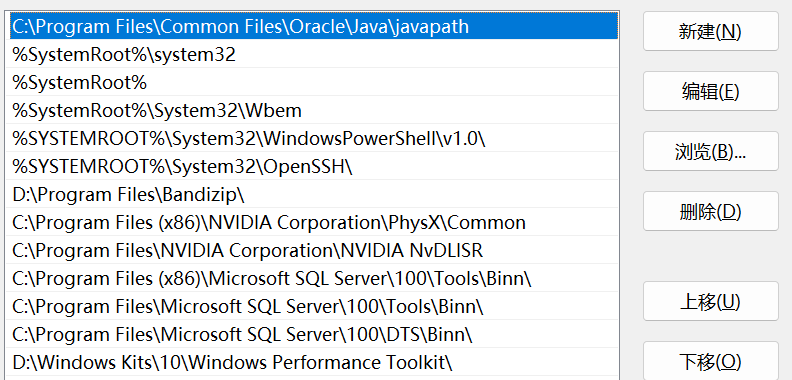

## 2.1 安装Java开发工具包


#### 2.1.1 下载JDK

在得到所需的软件之前必须弄清楚大量专业术语

| 术语                     | 缩写 | 解释                               |
| ------------------------ | ---- | ---------------------------------- |
| Java Development Kit     | JDK  | 编写Java的程序员使用的软件         |
| Java Runtime Environment | JRE  | 运行Java程序的用户使用的软件       |
| Server JRE               |      | 在服务器上运行Java程序的软件       |
| Standard Edition         | SE   | 用于桌面或简单服务器应用的Java平台 |
| Enterprise Edition       | EE   | 用于复杂服务器应用的Java平台       |
| Micro Edition            | ME   | 用于手机和其他小型设备的Java平台   |
| Updata                   | u    | Oracle的术语，表示Bug修正版本      |
| NetBeans                 |      | Oracle的集成开发环境               |

下载JKD需下载长期支持版本，即LTS版本，JDK的LTS版本包括：JDK 8、JDK 11、JDK 17 和 JDK 21


#### 2.1.2 CMD运行java程序

在JDK文件夹里，比较重要的有bin文件夹，该文件夹有javac和java

第一个程序：

```java
public class HelloWorld{
	public static void main(String[] args){
        System.out.println("HelloWorld");
    }
}
```

**类名和文件名需相同**，使用命令行运行程序之前，需使用cd命令，转到该文件夹下


`Javac`用于编译java代码，在使用`Javac`命令后，会在文件夹下多出一个同名但是后缀是.class的文件


之后，再使用 `java`命令运行该文件,注意，运行时，不需要后缀：

```java
java HelloWorld
```


运行成功！输出`Hello,World!`


#### 2.1.3 Path环境变量

想要在任意的目录下都可以打开指定的软件。就需要把软件的路径配置到环境变量中。在Windows系统中，找到

**高级系统设置**->**环境变量**->**系统变量**-->**Path**-->**编辑**：



可以看到，在安装JDK时，系统自动帮我们配置了一个环境变量，在这个文件夹里，就有jave.exe,javac.exe等程序


配置变量过程：

1. 在系统变量中点击新建，变量名位：`JAVA_HOME`
2. 变量值则为JDK文件夹：`D:\Java_Development\JDK21LTS`
3. 在`Path`中新建：`%JAVA_HOME%\bin`
4. 上移至第一位。


## 2.2 idea

idea是一个强大的集成开发环境，是java开发的不二之选


#### 2.2.1 安装idea

安装idea的方式非常简单，但注意安装的版本，这里选择的是2024.1.4版本。


#### 2.2.2 idea的第一个程序

idea项目结构介绍

```java
project(项目)
    module(模块)
    	package(包)
    		class(类)
```


##### 创建步骤

第一步:新建项目


点击Create创建项目

**第二部：创建模块**


点击`Project Structure`(项目结构)


然后点击ok


**第三步：创建package(包)**


可以把package(包)看成一个文件夹


**第四步：创建类**


总的来说，一个类可以看作一个程序，而class包含在package里面。package包含在moudle里，而moudle包含在project里。在创建包时，使用.隔开可以分级创建，如这样的一个包名：

```java
com.tww.test
```

会创建三层文件夹，第一层为com，第二层tww,第三层test。最后才在test包里创建类文件


**第五步：运行**


