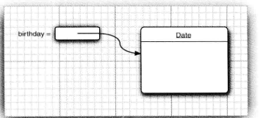
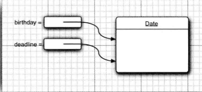

这一章将主要介绍如下内容：

- 面向对象程序设计
- 如何创建标准Java类库中的类对象
- 如何编写自己的类


## 4.1 面向对象程序设计概述

​	面向对象程序设计（简称OOP）是当今主流的程序设计范型。Java是完全面向对象的，必须熟悉OOP才能编写Java程序。**面向对象的程序是由对象组成的，每个对象包含对用户公开的特定功能部分和隐藏的实现部分**。程序中的很多对象来着标准库，还有一些是自定义的。从根本上说，只要对象能够满足要求，就不必关系其功能的具体实现过程。**在OOP中，不必关心对象的具体实现，只要能满足用户的需求即可**。

​	传统的结构化程序设计通过设计一系列的过程（即算法）来解决问题。一旦确定了这些过程，就要开始考虑存储数据的方式。Pascal语言的设计者Niklaus Wirth将其命名为《算法+数据结构=程序》。需要注意的是，在Writh命名的书中，算法是第一位，数据结构是第二位的。这就明确地表述了程序员的工作方式。首先要确定如何操作数据，然后再决定如何组织数据，以便操作数据。而OOP却调换了这个次序，将数据放在第一位，然后再考虑操作数据的算法。

​	面向对象更加适用于解决规模较大的问题。要想实现一个简单的Web浏览器可能需要大约2000个过程，这些过程可能需要对一组全局数据进行操作。而采用面向对象的设计风格，可能只需要大约100个类，每个类平均包含20个方法。


#### 4.1.1 类

​	**类**（`class`) 是构造对象的模板或蓝图。由**类构造（`construct`）对象的过程称为创建类的实例（`instance`)**。

​	**封装**（`encapsulation`，有时称为数据隐藏）是与对象有关的一个重要概念。从形式上看，封装将数据和行为组合在一个包中，并对对象的使用者隐藏了数据的实现方式。**对象中的数据称为实例域，操纵数据的过程称为方法。对于每个特定的类实例（对象）都有一组特定的实例域值。这些值的集合就是这个对象的当前状态**。

​	实现封装的关键在于绝对不能让类中的方法直接地访问其他类的实例域。程序仅通过对象的方法与对象数据进行交互。封装给了对象赋予“黑盒”特征，这是提供重用性和可靠性的关键。这意味着一个类可以全面地改变存储数据的方式，只要仍旧使用同样的方法操作数据，其他对象就不会知道或介意所发生的变化。

​	OOP的另一个原则是让用户自定义Java类变得轻而易举，这就是：可以通过扩展一个类来建立另一个新的类。事实上，在Java中，所有的类都源之于一个“神通广大的超类”，它就是**Object**。在下一章，可以看到有关Object类的详细介绍。

​	在扩展一个已有的类时，这个扩展后的新类具有所扩展的类的全部属性和方法，在新类中，只需提供适用于这个新类的新方法和数据域即可，通过一个类来建立另一个类的过程称为**继承**。有关继承的详细内容请看下一章。


#### 4.1.2 对象

对象的三个主要特性：

- 对象的行为（behaviro)——可以对对象施加哪些操作，或可以对对象施加哪些方法？
- 对象的状态（state）——当施加那些方法时，对象如何响应？
- 对象的标识（identity）——如何辨别具有相同行为和状态的不同对象？

同一个类的所有对象实例，由于支持相同的行为而具有家族式的相似性。对象的行为是用可调用的方法定义的。

此外，每个对象都保存着描述当前特征的信息。这就是对象的状态。对象的改变必须通过调用方法实现（如果不经过方法调用就可以对象状态，说明封装性遭到了破坏）


#### 4.1.3 识别类

传统的过程化程序设计，必须从顶部的main函数来开始编写程序。在面向对象程序设计没有所谓的“顶部”。应该从设计类开始，然后再往每个类中添加方法。

识别类的简单规则是分析问题的过程中寻找名词，而方法对应着动词。

例如，在订单处理系统中，有这样一些名词：

- 商品（Item）
- 订单（Order)
- 送货地址（Shipping address）
- 付款（Payment）
- 账户（Account）

这些每次很可能程序类Item、Order等。

接下来，查看动词：商品被添加到订单中，订单被发送或取消，订单货款被支付。对应每一个动词如："添加"、"发送"、“取消”、以及支付，都要标识出主要负责完成相应动作的对象。

当然，所谓“找名词与动词”原则只是一种经验，在创建类的时候，哪些名词和动词是重要的完全取决于个人的开发经验。


#### 4.1.4 类之间的关系

在类之间，最常见的关系有

- 依赖（"uses-a")
- 聚合("has-a")
- 继承（"is-a"）

​	**依赖**（`dependence`），即“uses-a”关系，是一种最明显的、最创建的关系。例如，Order类使用Account类是因为Order对象需要访问Account对象查看信用状态。但Item类不依赖Account类，这是因为Item对象与客户账户无关。**因此，如果一个类的方法操作另一个类的对象，我们就说，一个类依赖另一个类。**

​	应该尽可能地将相互依赖的类减至最少。如果类A不知道B的存在，它就不会关心B的任何改变。用软件工程的术语来说，就是让类之间的耦合度最小。

​	**聚合**（`aggregation`)，即"has-a"关系，是一种具体且易于理解的关系。例如，一个Order对象包含一些Item对象。**聚合关系意味着类A的对象包含类B的对象**

​	**继承**（inheritance）即“is-a”关系，是一种用于表示特殊与一般关系的。例如，RushOrder类由Order类继承而来。在具有特殊性的RushOrder类包含了一些用于优先处理的特殊方法，以及一个计算运费的不同方法；而其他方法，如添加商品、生成账单都是从Order类继承而来。**一般而言，如果类A扩展类B，类A补单会包含从类B继承的方法，还会拥有一些额外的功能**。

​	

## 4.2 使用预定义类

​	在Java中，没有类就无法做任何事情，我们前面曾经接触过几个类。然后，并不是所有的类都具有面向对象特征。例如，Math类，在程序中，可以使用Math.

random,并只需要知道方法名和参数，而不必了解它的具体实现过程。这正是封装的关键所在，所有的类都是这样。但遗憾的是，Math类只封装了功能，它不需要也不必要隐藏数据。由于没有数据，因此也不必担心生成对象以及初始化实例域。

​	


#### 4.2.1 对象与对象变量

要想使用对象，就必须首先构造对象，并指定其初始状态。然后，对对象应用方法

**在Java程序设计语言中，使用构造器（constructor)构造新实例，构造器是一种特殊的方法，用来构造并初始化对象**。下面看一个例子，在标准Java库中包含一个Date类，它的对象将描述一个时间点，例如："December 31,1999,23:59:59 GMT"。记到先导入Date包：`import java.util.Date`

**构造器的名字应该与类名相同**。因此Date类的构造器名为Date。要想构造一个Date对象，需要在构造器前面加上new操作符。如下所示：

```java
new Date();
```

这个表达式构造了一个新对象。这个对象被初始化为当前的日期和时间。也可以将这个对象传递给一个方法：

```java
System.out.println(new Date());
```

或者，也可以将一个方法应用于刚刚创建的对象。Date类中有一个`toString`方法。这个方法将返回日期用字符串描述：

```java
String s = new Date().toString();
```

在这两个例子中，构造的对象仅使用了一次。通常，希望构造的对象可以多次使用。因此，需要将对象存放在一个变量中：

```java
Date birthday = new Date();
```

下图显示了引用新构造的对象变量birthday




在对象与对象变量之间存在着一个重要的区别：

```java
Date deadline;
```

定义了一个对象变量deadline，它可以**引用**Date类型的对象。但是，一定要认识到：变量deadline不是一个对象，实际上也没有引用对象。此时，不能将任何Date方法应用于这个变量上：

```java
String s=deadline.toString();  //not 
```

必须首先初始化变量deadline，这里有两个选择。当然，可以用新构造的对象初始化这个变量，或者让这个变量引用一个已存在的对象：

```java
deadline =new Date();
//or
deadline =birthday;
```

现在，这两个变量引用同一个变量



一定要认识到：**一个对象变量并没有实际包含一个对象，而仅仅引用一个对象**。

在Java中，任何对象变量的值都是对存储在另一个地方的一个对象的引用。new操作符的返回值也是一个引用：

```java
Date deadline =new Date();
```

表达式**new Date()**构造了一个Date类型的对象，并且它的值是对新创建对象的引用。这个引用存储在变量deadline中。

可以显示的将对象设置为null，表明这个对象目前没有引用任何对象。

```java
deadline =null;
....
if(deadline !=null)
    System.out.println(deadline);
```

如果将一个方法应用于一个值为null的对象上，那么就会产生运行时的错误

```java
birthday =null;
String s=birthday.toString(); // error;
```

局部变量不会自动地初始化为null，而必须通过调用new或将它们设置为null进行初始化。


#### 4.2.2 Java类库中的LocalDate类

标准Java库中用LocalDate类来表示大家熟悉的日历表示法。将时间与日历分开是一种很好的面向对象设计。通常，最好使用不同的类表示不同的概念。

不要使用构造器来构造LocalDate类的对象。实际上，应当使用静态工厂方法（`factory method`)代表你调用构造器：
```
LocalDate.now();
```

上面的表达式会构造一个新对象，表示构造这个对象时的日期。

可以提供年、月和日来构造对应一个特定日期的对象：

```java
LocalDate.of(1999,12,31);
```

当然，通常都希望将构造的对象保存在一个特定的对象变量中：

```java
import java.time.LocalDate;
LocalDate newYearsEve = LocalDate.of(1999,12,13);
```

注意，要使用LocalDate类，需导入：`import java.time.LocalDate;`包

一旦有了一个LocalDate对象，可以用方法getYear、getMonthValue和getDayOfMonth得到年、月和日：

```java
int year = newYearsEve.getYear(); //1999
int month = newYearsEve.getMonthValue(); //12
int day = newYearsEve.getDayOfMonth(); //13
```

有时希望调用一些方法来得到更多信息。例如，plusDays方法会得到一个新的LocalDate，如果把应用这个方法的对象称为当前对象，这个新日期对象则是距前对象指定天数的一个新日期：

```java
LocalDate aThousandDaysLater = newYearsEve.plusDays(1000); //更新天数1000天
        year = aThousandDaysLater.getYear();
        month = aThousandDaysLater.getMonthValue();
        day = aThousandDaysLater.getDayOfYear();
        System.out.println(year+"-"+month+"-"+day);
```


#### 4.2.3 更改器方法与访问器方法

```java
LocalDate aThousandDaysLater = newYearsEve.plusDays(1000); //更新天数1000天
```

​	plusDays方法会生成一个新的LocalDate对象，然后把这个新对象赋值给aThousandDaysLater变量。原对象不会做任何改动。我们叫这种方法是**访问器方法**。这种方法，不会更改对象的值。


Java库有一个较早版本曾有另一个类来处理日历。名为GregorianCalendar。可以如下为这个类表示的一个日期增加1000天：

```java
GregorianCalendar someDay = new GregorianCalendar(1999,11,31);
someDay.add(Calendar.DAY_OF_MONTH,1000);
```

`GregorianCalendar.add`是一个**更改器方法**。调用这个方法后，someDay对象的状态会改变。


下面用一个应用LocalDate类的程序来结束本节内容的论述。这个程序将显示当前月的日历，其格式为：

```java
Mon Tue Wed Thu Fri Sat Sun
              1   2   3   4 
  5   6   7   8   9  10* 11 
 12  13  14  15  16  17  18 
 19  20  21  22  23  24  25 
 26  27  28  29  30  31
```

当日用一个*号标记。可以看到，这个程序显示某月的天数以及当日是星期几。

下面看一下这个程序的关键步骤。首先构造一个日历对象，并用当前的时间和日期进行初始化：

```java
LocalDate date=LocalDate.now();
```

下面获取当前的月和日。

```java
int month =date.getMonthValue();
int today = date.getDayOfMonth(); //记录今天
```

然后，将date设置为这个月的第一天，并得到这一天为星期几。

```java
date = date.minusDays(today-1); //生成当前日期前n天的日期
DayOfWeek weekday = date.getDayOfWeek();
int value = weekday.getValue(); //得到当前日期是星期几。
```

变量weekday设置为`DayOfWeek`类型的对象。调用这个对象的`getValue`方法来得到星期几的一个数值，这会得到一个整数。星期一就返回1，星期二就返回2，以此类推。

注意，日历的第一行是缩进的，使得月份的第一天指向相应的星期几。下面的代码会打印表头和第一行的缩进：

```java
System.out.println("Mon Tue Wed Thu Fri Sat Sun");
for(int i=1;i<value;i++)
    System.out.print(" ");
```

现在来打印日历的主题。进入一个循环，其中date便利一个月的每一天。

每次迭代时，打印日期值。如果date是当前日期，这个日期则用一个*标记。接下来，把date推进的下一天。如果到达新的一周的第一天，则换行打印：

```java
while(date.getMonthValue() == month)
{
    System.out.printf("%3d",date.getDayOfMonth());//打印天
    if(date.getDayOfMonth() == today)//如果是今天就打印*号
        System.out.print("*");
    else
		System.out.print(" "); //否则打印空格
    date = date.plusDays(1); //更新一天
    //如果是星期一，就换行。
    if(date.getDayOfWeek().getValue() == 1)
        System.out.println();
}
```

那么什么时候结束呢。直到更新的天数已经让这个月过去了。那么这个循环就结束了。

下面是完整的程序

```java
package TWW;
import java.time.*;
public class CalendarTest {
    public static void main(String[] args){
        LocalDate date=LocalDate.now();
        int month =date.getMonthValue();//记录当月
        int today = date.getDayOfMonth(); //记录今天
        date = date.minusDays(today-1); //生成当前日期前n天的日期
        DayOfWeek weekday = date.getDayOfWeek(); // 获取日期在当月是星期几
        int value = weekday.getValue(); //得到当前日期是星期几。

        //打印表头和空格
        System.out.println("Mon Tue Wed Thu Fri Sat Sun");
        for(int i=1;i<value;i++)
            System.out.print("    ");

        //打印日历主体：
        while(date.getMonthValue() == month)
        {
            System.out.printf("%3d",date.getDayOfMonth());//打印天
            if(date.getDayOfMonth() == today)//如果是今天就打印*号
                System.out.print("*");
            else
                System.out.print(" "); //否则打印空格
            date = date.plusDays(1); //更新一天
            //如果是星期一，就换行。
            if(date.getDayOfWeek().getValue() == 1)
                System.out.println();
        }
    }
}
```

输出：

```java
Mon Tue Wed Thu Fri Sat Sun
              1   2   3   4 
  5   6   7   8   9  10* 11 
 12  13  14  15  16  17  18 
 19  20  21  22  23  24  25 
 26  27  28  29  30  31
```

利用LocalDate类可以编写一个日历程序，能处理星期几以及各月天数不同等复杂问题。并不需要知道LocalDate类如何计算月和星期几。只需呀知道这个类的接口。如plusDays和getDayOfWeek方法。

##### API`java.time.LocalDate`

**static LocalDate now()**

构造一个表示当前日期的对象

**static LocalDate of(int year,int month,int day)**

构造一个表示给定日期的对象

**int getYear()**

**int getMonthValue()**

**int getDayOfMonth()**

得到当前日期的年、月和日。

**DayOfWeek getDayOfWeek**

得到当前日期是星期几，作为DayOfWeek类的一个实例返回，通过调用getValue来得到1~7之间的一个数，表示星期几，1表示星期一，7表示星期日。

**LocalDate plusDays(int n)**

生成当前日期前n天的日期。如果参数是负数，则是生成当前日期之后n天的日期。


## 4.3 用户自定义类

​	从第3章中，已经开始编写一些简单的类。但是，那些类都只包含一个简单的main方法。现在开始学习如何设计复杂应用程序所需要的各种主力类。通常，这些类没有main方法，却有自己的实例域和实例方法。要想创建一个完整的程序，应该将若干类组合在一起，其中只有一个类有main方法。


#### 4.3.1 Employee类

类的一般定义形式为：

```java
class ClassName
{
    类成员1;
    类成员2;
    ...
    
    构造方法1;
    构造方法2;
    
    方法1;
    方法2;
}
```

下面我们编写一个雇员类来管理一个雇员的信息：

```java
class Employee
{
   //私有成员
    private String name; //名字
    private double salary;//薪水
    private LocalDate hireDay; //雇佣日期
    
    //构造方法
    public Employee(String n,double s ,LocalDate hireday_method)
    {
        name = n;
        salary = s;
        hireDay=hireday_method;
    }
    
    //提供方法访问私有化成员
    public String getName()
    {
        return name;
    }
    
    public double getSalary()
    {
        return salary;
    }
    
    publuc LocateDate getHireDay()
    {
     	retrun hireDay;   
    }
}
```

下面我们让一个程序来使用这个类：

```java
import java.time.*;
public class EmployeeTest {
    public static void main(String[] args)
    {
        //创建一个类数组，存储3位员工的信息
        Employee[] employees = new Employee[3];

        //使用构造方法
        employees[0]=new Employee("张三",3500,1990,12,13);
        employees[1]=new Employee("李四",4000,1991,8,16);
        employees[2]=new Employee("王五",4500,1998,1,21);

        //给每位员工涨薪
        for(Employee e:employees)
            e.raiseSalary(5);

        System.out.println("现在，每位员工的信息是");
        for(Employee e:employees)

            System.out.println("姓名："+e.getName()+" 工资："+e.getSalary()+" 入职日期："+e.getHireDay());

    }
}

class Employee
{
    //私有成员
    private String name; //名字
    private double salary;//薪水
    private LocalDate hireDay; //雇佣日期

    //构造方法
    public Employee(String n,double s ,int year,int month,int Day)
    {
        name = n;
        salary = s;
        hireDay=LocalDate.of(year,month,Day);
    }

    //提供方法访问私有化成员
    public String getName()
    {
        return name;
    }

    public double getSalary()
    {
        return salary;
    }

    public LocalDate getHireDay()
    {
        return hireDay;
    }

    //加薪方法：使员工提高%n的工资
    public void raiseSalary(double byPercent)
    {
        double raise = salary*byPercent /100;
        salary +=raise;
    }
}
```

再次声明：**文件名必须与public类的名字相匹配。在一个源文件中，只能有一个公有类**，其他类不做限制。


#### 4.3.2 多个源文件的使用

当类不在一个源文件中时，例如，把employee类存放在文件`employee.java`中。如果喜欢这样组织文件，可以使用通配符调用Java编译器：

```java
Javac Employee*.java
```

现在，所有与通配符匹配的源文件都将被编译成类文件。


或者，输入下列命令：

```java
javac EmployeeTest.java
```

这种方式没有显示的编译Employee.java。但编译器发现程序中使用了Employee类时，会查找该类，然后进行编译。


#### 4.3.3 剖析Employee类

这个类包含一个构造器和4个方法：

```java
public Employee(String n,double s ,int year,int month,int Day)
public String getName()
public double getSalary()
public LocalDate getHireDay()
public void raiseSalary(double byPercent)
```

这个类的所有方法都被标记为`public`。关键字`public`意味着任何类的任何方法都可以调用这些方法（共有4种访问级别）

接下来，Emlpoyee类中有三个实例域来存放将要操作的数据：

```java
    private String name; //名字
    private double salary;//薪水
    private LocalDate hireDay; //雇佣日期
```

关键字`private`确保只有Employee类自身能够访问这些实例域。


#### 4.3.4 从构造器开始

Employee的构造器：

```java
    //构造方法
    public Employee(String n,double s ,int year,int month,int Day)
    {
        name = n;
        salary = s;
        hireDay=LocalDate.of(year,month,Day);
    }
```

构造器与类同名。构造器总是伴随着new操作符的执行被调用

```java
new Employee("张三",3500,1999,1,8);
```

不能对一个已经存在的对象调用构造器来达到重新设置实例域的目的：

```java
jame.Employee("张三",3500,1999,1,8); //error
```

将产生编译错误。


关于构造器：

- 构造器与类同名
- 每个类可以有一个以上的构造器
- 构造器可以有0个、1个或多个参数
- 构造器没有返回值
- 构造器总是伴随着new操作一起调用


#### 4.3.5 隐式参数和显式参数

方法用于操作对象以及存取它们的实例域。例如，方法：

```java
    public void raiseSalary(double byPercent)
    {
        double raise = salary*byPercent /100;
        salary +=raise;
    }
```

调用：

```java
number007.raiseSalary(5);
```

它将结果number007.salary域的值增加%5，实际上，这个调用将执行下列指令：

```java
        double raise = number007.salary*byPercent /100;
        number007.salary +=raise;
```

**出现在方法名前的对象，称为隐式参数。而位于方括号中的数值，是一个显示参数**。在这个例子中，number007为隐式参数。5为显式参数。

可以看到，显式参数是明显的列在方法声明中的，而隐式参数没有出现在方法声明中。

在每一个方法中，**关键字this表示隐式参数**。可以用下面的方式编写raiseSalary方法：

```java
    public void raiseSalary(double byPercent)
    {
        double raise = this.salary*byPercent /100;
        this.salary +=raise;
    }
```

这样做的好处是可以将实例域与函数参数明显的区分开来。


#### 4.3.6 封装的优点

```java
    public String getName()
    {
        return name;
    }

    public double getSalary()
    {
        return salary;
    }

    public LocalDate getHireDay()
    {
        return hireDay;
    }
```

这些都是典型的访问器方法。由于它们只返回实例域值，因此又被称为域访问器。

一般的类，需要提供下面三项内容以此获得或设置实例域的值：

- 一个私有的数据域；
- 一个公有的域访问器方法；
- 一个公有的域更改器方法。


#### 4.3.7 基于类的访问权限

方法可以访问所调用对象的私有数据。而且**一个方法可以访问所属类的所有对象的私有数据**。

典型的调用方式是

```java
if(harry.equals(boss))...
```

这个方法访问了harry的私有域，还访问了boss的私有域。这是合法的，boss和harry是同一类对象。相同类的对象之间的方法，可以互相访问。


#### 4.3.8 私有方法

​	在实现一个类时，由于公有数据非常危险，所以应该将所有的数据域设置为私有的。而方法，大多数都被设计为公有。但是在某些特殊情况下，也可能将它们设置为私有方法。如一些辅助方法

​	在Java中，实现一个私有的方法，只需将关键字`public`改为`private`即可。


#### 4.3.9 final实例域

​	可以将实例域定义为final。构建对象时必须初始化这样的域，必须确保在构造执行后，这个域的值被设置，并且在后面的操作中，不能再对他进行修改。即没有set方法。

```java
class Employee
{
    private final String name;
}
```

final修饰符大多数应用于**基本类型域**,或**不可变类的域**（如果类中的每个方法都不会改变其对象，这个类就是不可变类，如String类）。

**final关键字只是表示存储在变量中的对象引用不会再指示其他对象**


## 4.4 静态域与静态方法

main方法都被标记为static修饰符。现在来讨论一下这个修饰符的含义。


#### 4.4.1 静态域

​	**一个静态域，它属于类，而不属于任何独立的对象。对象共享一个静态域**。也就是说，如果将域定义为static，每个类中只有这样一个的域。而每一个对象对于所有的实例域却都有自己的一份拷贝。

例如，假定需要给每一个雇员赋予唯一的标识码。这里给Employee类添加一个实例域id和一个静态域nextId：

```java
class Employee
{
    private static int nextId=1;
    private int id;
}
```

现在，每一个雇员都有一个自己的id域。但是这个类的所有实例将共享一个nextId域。

下面是静态域一个简单的用法

```java
public void setId()
{
    id=nextId;
    nextId++;
}
```


#### 4.4.2 静态常量

Math类中定义了一个静态常量：

```java
public class Math
{
    public static final double PI = 3.14159265358979323846;
}
```

在程序中，可以采用`Math.PI`的形式获取这个常量

最好不要将域设计为public，但公有常量却没问题。即`public static`


#### 4.4.3静态方法

**静态方法是一种不能向对象实施操作的方法**。如Math类的pow方法就是一个静态方法，表达式：

```java
Math.pow(x,a);
```

这个方法返回x的a次方。在运算时，不使用任何Math对象。

**静态方法是没有this参数的方法**。

**静态方法不能访问实例域，因为它不能操作对象，但静态方法可以访问自身类中的静态域**：

```java
public static int getNextId()
{
    return nextId;  //nextId是静态域
}
```

**可以通过类名调用静态方法**。

```java
int n=Employee.getNextId();
```


在下面两种情况下使用静态方法：

- 一个方法不需要访问对象状态，其所需参数都是通过显示参数提供（例如：Math.pow)。
- 一个方法只需要访问类的静态域


#### 4.4.4 工厂方法（factory method）

静态方法还有另外一种用途。类似于LocalDate的类使用静态工厂方法来构造对象。如`LocalDate.now`和`LocalDate.of`

静态工厂方法是一种通过 **类的静态方法** 返回对象实例的方式，用于替代 `new` 关键字直接调用构造器的方式。


#### 4.4.5 main方法

静态方法的调用不需要对象，例如，不需要构造Math类对象就可以调用Math.pow。

同理，main方法也是一个静态方法

```java
public class Application
{
    public satatic void main(String[] args)
    {
        ...
    }
}
```

main方法不对任何对象进行操作


## 4.5 方法参数

​	首先回顾一下有关参数传递给方法的一些专业术语。**按值调用**表示方法接受的是调用者提供的值。而**按引用调用**表示方法接收的是调用者提供的变量地址。方法可以修改传递引用所对象的变量值，而按值调用不能修改所对应的变量值。

​	Java程序设计语言总是采用**按值调用**。也就是说，**方法得到的是参数值的一个拷贝，方法不能修改传递给它的任何参数变量内容**。

```java
double percent=10;
harry.raiseSalary(percent);
```

在方法执行过后，percent变量不会受到方法的任何影响，它的值还是10。


方法参数共有两种类型：

- 基本数据类型
- 对象引用

以对象引用作为参数可以很好的修改对象中的域。下面将一个雇员的薪资提高两倍的操作:

```java
public static void tripleSalary(Employee x)
{
    x.raiseSalary(200);
}

//调用
Employee harry = new Employee(...);
tripleSalary(harry);
```

具体的执行过程：

1) x被初始化为harry值的拷贝，这个值是一个对象的引用。
2) x和harry同时引用了这个对象，让这个对象工资提高了%200；
3) 方法结束后，参数变量x不再使用。而对象变量harry继续引用那个薪资增至3倍的雇员对象。


现在，编写一个交换两个雇员对象的方法：
```
public static void swap(Employee x,Employee y)
{
	Employee temp =x;
	x=y;
	y=temp;
}
```

​	如果Java对对象采用的是按引用调用，那么这个方法就应该能够实现交换数据的效果。但是，方法并没有改变存储在变量a和b中的对象引用。swap方法的参数x和y倍初始化为两个对象引用的拷贝，这个方法交换的是这两个拷贝。最终，在方法结束时参数变量x和y被丢弃了，原来的a和b仍然引用这个方法调用前的对象。

这个过程说明：**Java程序设计语言对对象采用的不是引用调用。实际上，对象引用是按值传递的**。

下面总结Java中方法参数的使用情况：

**一个方法不能修改一个基本数据类型的参数。**

**一个方法可以改变一个对象参数的状态。**

**一个方法不能让对象参数引用一个新的对象。**


## 4.6 对象构造

​	简单的构造器可以定义对象的初始状态。由于对象构造非常重要，所有Java提供了多种编写构造器的机制。


#### 4.6.1 重载

类可以有多个构造器。例如，可以构造一个空的StringBuilder对象：

```java
StringBuilder message = new StringBuilder();
```

或者可以指定一个初始化字符串：

```java
StringBuilder toDoList=new StringBuilder("To do:\n");
```

​	这种特征叫做**重载**。**多个方法有相同的名字，不同的参数，便产生了重载**。编译器通过用各个方法给出的参数类型域特定方法调用所使用的值类型进行匹配挑选相应的方法。如果编译器找不到匹配的参数，就会参数编译时错误，根本不存在匹配。（这个过程叫重载解析）


注释：**Java允许重载任何方法。方法名以及参数类型，叫做方法的签名。返回类型不是方法签名的一部分**。也就是说，不能有两个名字相同、参数类型也相同，返回类型却不同的方法。


#### 4.6.2 默认域初始化

如果构造器中没有显示地给域赋予初值，那么会自动地赋为默认值：数值为0、布尔值为false、对象引用为null。注意，这不是一种良好的编程习惯。


#### 4.6.3 无参数的构造器

很多类都包含一个无参数的构造器，对象由无参数构造函数创建时，其状态会设置为适当的默认值。例如，以下是Employee类的无参数构造函数：

```java
public Employee()
{
    name="";
    salary=0;
    hireDay =LocalDate.now();
}
```

如果在编写一个类时没有编写构造器，那么系统会提供一个无参数构造器。这个构造器将所有的实例域设置为默认值。

如果类中至少提供了一个构造器，但是没有提供无参数的构造器，则在构造对象时如果没有提供参数就会被视为不合法。


警告：如果想要这个类的用户采用下列方式构造实例：

```java
new ClassName()
```

就必须提供一个默认的构造器。如果希望无参数构造器赋予默认值，可以采用下列格式：

```java
public ClassName()
{
    
}
```


#### 4.6.4 参数名

在编写很小的构造器时，常常在参数命名上出现错误。

通常，参数用单个字符命名：

```java
public Employee(String n,double s)
{
    name =n;
    salary = s;
}
```

这样做有一个缺陷，只有阅读代码才能了解n和s的含义。


有一种常用的技巧：采用this访问该对象的实例域，而参数变量用同样的名字。这样读者一眼就能读懂参数的含义。还能区分实例域和参数变量：

```java
public Employee(String name,double salary)
{
    this.name =name;
    this.salary = salary;
}
```


#### 4.6.6 调用另一个构造器

关键字this引用方法的隐式参数。然而，如果关键字第一个语句形如this(...)，这个构造器将调用同类的另一个构造器。如下：

```java
public Employee(String,double)
{
    //如同调用Employee(String,double)构造器。
    this("Employee #"+nextId,s);
    nextId++;
}
```


#### 4.6.7 初始化块

在一个类的声明中，可以包含多个代码块。只要构造类的对象，这些块就会被执行。

```java
class Employee
{
    private static int nextId;
    private int id;
    //私有成员
    private String name; //名字
    private double salary;//薪水
    private LocalDate hireDay; //雇佣日期

    //初始化块
    {
        id=nextId;
        nextId++;
    }
    //构造方法
    public Employee(String n,double s ,int year,int month,int Day)
    {
        name = n;
        salary = s;
        hireDay=LocalDate.of(year,month,Day);
    }
    public Employee(String name,double salary)
    {
        this.name=name;
        this.salary=salary;
    }
    public Employee(){}
    
}
```

无论使用哪个构造器构造对象。id域都在对象初始化块中被初始化。首先运行初始化块，然后才运行构造器的主题部分。

这种机制不是必须的，也不常见。通常会直接将初始化代码放在构造器中。


初始化数据域有多种途径。下面是调用构造器的具体处理步骤：

1. 所有数据域被初始化为默认值（0、false或null）
2. 安装在类声明中出现的次序，依次执行所有域初始化语句和初始化块。
3. 如果构造器第一行调用了第二个构造器，则执行第二个构造器主题。
4. 执行这个构造器的主体。


**可以使用一个静态的初始化块来对静态域进行初始化**。

```java
static
{
    nextId=1;
}
```

在类第一次加载的时候，将会进行静态域的初始化。


下面一个程序展示了本节很多特性：

- 用重载构造器
- 用this()调用另一个构造器
- 无参数构造器
- 对象初始化块
- 静态初始化块
- 实例域初始化

```java
package TWW;
import java.time.*;
import java.util.*;

public class EmployeeTest {
    public static void main(String[] args)
    {
        //创建一个类数组，存储3位员工的信息
        Employee[] employees = new Employee[3];

        //使用构造方法
        employees[0]=new Employee("张三",3500);
        employees[1]=new Employee(4000);
        employees[2]=new Employee();

        System.out.println("现在，每位员工的信息是");
        for(Employee e:employees)
            System.out.println("姓名："+e.getName()+" 工资："+e.getSalary()+" id："+e.getId());

    }
}

class Employee {
    private static int nextId;
    private int id;
    //私有成员
    private String name = ""; //实例域初始化
    private double salary;//薪水

    //静态初始化块
    static
    {
        Random generator=new Random();
        nextId=generator.nextInt(1000);
    }

    //初始化块
    {
        id=nextId;
        nextId++;
    }

    //构造方法
    public Employee(String n,double s)
    {
        name = n;
        salary = s;
    }
    public Employee(double s)
    {
        //等于调用Employee(String n,double s);
        this("Employee #"+nextId,s);

    }
    //无参数构造器
    public Employee(){}


    //提供方法访问私有化成员
    public String getName()
    {
        return name;
    }

    public double getSalary()
    {
        return salary;
    }

    public int getId(){
        return id;
    }

    //加薪方法：使员工提高%n的工资
    public void raiseSalary(double byPercent)
    {
        double raise = salary*byPercent /100;
        salary +=raise;
    }

    public static void tripleSalary(Employee x)
    {
        x.raiseSalary(200);
    }

}
```

##### API `java.util.Random`

**Random()**

构造一个新的随机数生成器

**int nextInt（int n）**

返回一个0~n-1之间的随机数。


## 4.7 包

Java允许使用包（package）将类组织起来。借助于包可以方便地组织自己的代码。

标准的Java类库分布在多个包中，包括java.lang、java.util和jave.net等。使用包的主要原因是确保类名的唯一性。


#### 4.7.1 类的导入

​	一个类可以使用所属包中的所有类，以及其他包中的公有类。我们可以采用两种方式访问另一个包中的公有类。第一种方式是在每个类名之前添加完整的包名。例如：

```java
java.time.LocalDate today =java.time.LocalDate.now();
```

这显然非常繁琐。所以更简单且更常用的是使用`import`语句。

**`import`语句是一种引用包含在包中的类简单描述。可以使用import语句导入一个特定的类或整个包**。`import`语句应该位于源文件的顶部（但位于package语句的后面）。例如，可以使用下面这条语句导入java.util包中的所有类

```java
import java.util.*;
```

现在就可以使用：

```java
LocalDate today =LocalDate.now();
```

还可以导入一个包中的特定类：

```java
import java.time.LocalDate;
```


`java.time.*`的语法比较简答，但需要注意的是，只能用星号（*）导入一个包，而不能使用import java.\*或import java.\*.\*导入以java为前缀的所有包。

如果两个包中都有同名的类，需要注意你是要使用的是哪个包的类：

```java
import java.util.*;
import java.sql.*;
```

uitl和sql都有日期类。在程序使用Date类的时候，就会出现编译错误。


#### 4.7.2 静态导入

import语句不仅可以导入类，还增加了导入静态方法和静态域的功能：

```java
import static java.lang.System.*;
```

就可以使用System类的静态方法和静态域，而不必加类名前缀：

```java
out.println("GoodBye");
exit(0); //System.exit
```


## 4.9 文档注释

​	JDK包含一个很有用的工具，叫做`javadoc`。它可以由源文件生成一个HTML文档。如果在源代码中添加专用的定界符/\*\*开始的注释，使用javadoc命令可以生成一个具有专业水准的文档。


#### 4.9.1 注释的插入

javadoc使用程序（utility）从下面几个特性中抽取信息：

- 包
- 公有类与接口
- 公有的和受保护的构造器及方法
- 公有的和受保护的域

应该在上面几个部分编写注释。注释应该设置在所描述特性的前面。注释以/\*\*开始。并以*/结束。

每个/\*\*..... */文档注释，在标记后紧跟着**自由格式文本**。标记由@开始，如@author或@param。在自由格式文本中，可以使用HTML修饰符。例如\<em>....\</em>或者包含图形的\等


#### 4.9.2类注释

类注释必须放在import语句之后，类定义之前。

例如：

```java
/**
	A card
*/
public class Card
{
    ...
}
```


#### 4.9.3 方法注释

每一个方法注释必须放在所描述的方法之前。除了通用标记之外，还可以使用下面的标记：

**@param** 变量描述

这个标记对当前方法的"param"（参数）部分添加一个描述。这个描述可以占据多行。一个方法的所有@param标记必须放在一起

**@return** 描述

这个标记将对当前方法添加“return"部分的描述。这个描述可以跨越多行，并可以使用HTML标记。

**@throws**类描述

这个标记添加一个注释，用于表示这个方法可能抛出异常。

下面是一个方法注释的示例：

```java
/**
	这个方法用于提高员工的工资
	@param byPercent 提高工资的百分比
	@return 返回加薪的金额
*/
public double raiseSalary(double byPercent)
{
    double raise=salary*byPercent/100;
    salary+=raise;
    return raise;
}
```


#### 4.9.4 域注释

只需要对公有域（通常指静态常量）建立文档注释：

```java
/**
	The "Heats" card suit
*/
public static final int HEARTS=1;
```


#### 4.9.5 通用注释

下面的标记可以用在类文档的注释中

**@author** 姓名

这个标记将产生一个"author"（作者）条目。可以使用多个标记，每个@author标记对应一个作者。

**@version**文本

这个标记用于描述当前版本

**@since** 文本

这里标记用于描述引入特性的版本描述。例如：@since version 1.7.1。

**@deprecated**文本

这个标记将对类、方法或变量添加一个不再使用的注释。文本中给出取代的建议

**@see**引用

这个标记将在“see also”部分增加一个超链接。

下面给一个程序添加上这些注释
```java
package TWW;

import java.time.*;
public class EmployeeTest {
    public static void main(String[] args)
    {
        //创建一个类数组，存储3位员工的信息
        Employee[] employees = new Employee[3];

        //使用构造方法
        employees[0]=new Employee("张三",3500,1990,12,13);
        employees[1]=new Employee("李四",4000,1991,8,16);
        employees[2]=new Employee("王五",4500,1998,1,21);

        //给每位员工涨薪
        for(Employee e:employees)
            e.raiseSalary(5);

        System.out.println("现在，每位员工的信息是");
        for(Employee e:employees)

            System.out.println("姓名："+e.getName()+" 工资："+e.getSalary()+" 入职日期："+e.getHireDay());

    }
}

/**
 * @author TIAN
 * @version 0.1
 * @since 0.1
 *
 * */
class Employee
{
    //私有成员
    private String name; //名字
    private double salary;//薪水
    private LocalDate hireDay; //雇佣日期

    //构造方法
    public Employee(String n,double s ,int year,int month,int Day)
    {
        name = n;
        salary = s;
        hireDay=LocalDate.of(year,month,Day);
    }

    //提供方法访问私有化成员
    public String getName()
    {
        return name;
    }

    public double getSalary()
    {
        return salary;
    }

    public LocalDate getHireDay()
    {
        return hireDay;
    }

    /**
     这个方法用于提高员工的工资
     @param byPercent 提高工资的百分比
     @return 返回加薪的金额
     */
    public void raiseSalary(double byPercent)
    {
        double raise = salary*byPercent /100;
        salary +=raise;
    }
}
```


## 4.10 类设计技巧

1. 一定要保证数据私有
2. 一定要对数据初始化
3. 不要在类中实用过多的基本类型
4. 不是所有域都需要独立的域访问器和域更改器
5. 将职责过多的类进行分解
6. 类名和方法名要能体现它们的职责
7. 优先使用不可变的类


