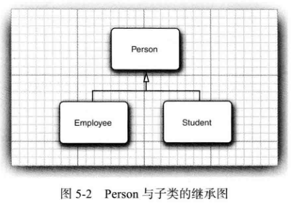

​	本章将学习面向对象程序设计的另一个基本概念：继承。利用继承，人们可以给予已存在的类构造一个新类。继承已存在的类就是复用这些类的方法和域。在此基础上，还可以添加一些新的方法和域，以满足新的需求。这是Java程序设计中的一项核心技术。

​	另外。还将阐述反射的概念。反射是指在程序运行期间发现更多的类及其属性的能力。这是一个功能强大的特性，使用起来比较复杂，主要用于开发软件工具。


## 5.1 类、超类和子类

​	普通雇员在完成本职任务之后仅领取薪水。而经理在完成了预期的业绩之后还能得到讲解。这种关系就需要使用继承，将经理定义为一个新类Manager，以便增加一些新供能。可以重用Employee类中已经编写的部分代码，并将其中的所有与保留下来。


#### 5.1.1 定义子类

下面是由Employee类来定义Manager类的格式，关键字`extends`表示继承

```java
public class Manager extend Employee
{
 ...   
}
```

关键字extends表明正在构造的新类派生于一个已存在的类。已存在的类称为`超类`、`基类`或`父类`；而新类称为`子类`、派生类。

在Manager类中，增加了一个用于存储奖金信息的域，以及一个用于设置这个域的新方法：

```java
public class Manager extend Employee
{
    private double bonus;
    
    public void setBonus(double bonus)
    {
        this.bonus=bonus;
    }
}
```

由于setBonus方法并不是在Employee类中定义的，所以属于Employee类的对象不能使用它。也就是父类无法使用子类方法。

​	然而，尽管Manager类中没有显式的定义getName等方法，但属于Manager类的对象却可以使用它们。Manager类自动地继承类父类Employee中的这些方法和属性。

​	**在通过扩展超类定义子类的时候，仅需指出子类与超类的不同之处。因此在设计类的时候，应该将通用的方法放在超类中，而将具有特殊用途的方法放在子类中**。这种将通用的功能放到超类的做法，在面向对象程序设计中非常普遍。


#### 5.1.2 覆盖方法

父类中的有些方法对子类Manager不一定使用。此时，需要提供一个新的方法来覆盖（override）父类中的方法：

```java
public class Manager extend Employee
{
    private double bonus;
    
    public void setBonus(double bonus)
    {
        this.bonus=bonus;
    }
    public double getSalary()
    {
        ...
    }
}
```

​	Manager类中的getSalary（）方法应该返回薪水和奖金的总和。**但Manager类的getSalary方法不能直接地方法父类的私有成员。只有Employee类的方法才能够访问私有部分。如果Manager类的方法一定要访问私有域，那么就必须借用父类的公有接口,我们使用关键字super来调用属于父类的方法**：

```java
    public double getSalary()
    {
       double baseSalary=super.getSalary(); //调用父类方法访问Salary
       return baseSalar+bonus;
    }
```

也就是说，**子类无法直接访问父类的私有成员，但可以通过父类的方法来间接访问**。


#### 5.1.3 子类构造器

同样的，使用super关键字可以使用父类的构造器。

```java
public Manager(String name,double salar,int year,int month,int day)
{
    super(name,salar,year,month,day);
    bonus=0;
}
```

​	由于Manager类的构造器不能访问Employee类的私有成员。所以必须利用Employee的构造器进行初始化，**通过`super`实现对父类构造器的调用。使用super调用构造器的语句必须是子类构造器的第一条语句**。

​	

下面创建一个经理对象，并设置它的奖金：

```java
Manager Hr =new Manager("王五",15000,2009,12,06);
Hr.setBonus(5000);
```

定义一个包含3个雇员的数组：

```java
Employee[] arr =new Employee[3];
```

把经理和雇员都放到数组中：

```java
arr[0]=Hr;
arr[1]=new Employee("李四",12000,1989,10,1);
arr[2]=new Employee("张三",13000,1987,3,15);
```

输出每个人的薪水：

```java
 for(Employee e:employees)
       System.out.println("姓名："+e.getName()+" 工资："+e.getSalary());
```

输出结果：

```java
现在，每位员工的信息是
姓名：王五 工资：20000.0
姓名：李四 工资：4000.0
姓名：张三 工资：4500.0
```

​	尽管e声明为Employee类型，但e既可以引用Employee类型的对象，也可以引用子类Manager类型的对象。虚拟机知道e实际引用的对象类型，因此能够正确的调用相应的方法。也就是说，**父类对象可以引用子类对象**，是实现多态的关键。

当父类对象引用了子类对象时：

1. 若子类重写了父类的方法，通过父类引用调用该方法时，实际执行的是子类的方法。这是运行时多态的体现
2. 父类引用无法直接调用子类独有的方法，需通过向下转型，且转型前需确保对象确实是子类实例


**一个对象变量可以指示多种实际类型的现象被称为多态。在运行时能够自动地选择调用哪个方法的现象称为动态绑定**。

```java
package TWW;

import java.time.*;
public class EmployeeTest {
    public static void main(String[] args)
    {
        Manager Hr =new Manager("王五",15000,2009,12,06);
        Hr.setBonus(5000);
        //创建一个类数组，存储3位员工的信息
        Employee[] employees = new Employee[3];

        //使用构造方法
        employees[0]=Hr;
        employees[1]=new Employee("李四",4000,1991,8,16);
        employees[2]=new Employee("张三",4500,1998,1,21);
        
        System.out.println("现在，每位员工的信息是");
        for(Employee e:employees)
            System.out.println("姓名："+e.getName()+" 工资："+e.getSalary());

    }
}

/**
 * @author TIAN
 * @version 0.1
 * @since 0.1
 *
 * */
class Employee
{
    //私有成员
    private String name; //名字
    private double salary;//薪水
    private LocalDate hireDay; //雇佣日期

    //构造方法
    public Employee(String n,double s ,int year,int month,int Day)
    {
        name = n;
        salary = s;
        hireDay=LocalDate.of(year,month,Day);
    }

    //提供方法访问私有化成员
    public String getName()
    {
        return name;
    }

    public double getSalary()
    {
        return salary;
    }

    public LocalDate getHireDay()
    {
        return hireDay;
    }

    /**
     这个方法用于提高员工的工资
     @param byPercent 提高工资的百分比
     @return 返回加薪的金额
     */
    public void raiseSalary(double byPercent)
    {
        double raise = salary*byPercent /100;
        salary +=raise;
    }
}

/**
	Employee类的子类：Manager
	@author TIAN
	@version 0.0.1
*/
class Manager extends Employee{
    double bonus;

    public Manager(String name,double salary,int year,int month,int day)
    {
        super(name,salary,year,month,day);
        bonus=0;
    }

    public void setBonus(double bonus){
        this.bonus=bonus;
    }
    public double getSalary(){
        double Salary=super.getSalary();
        return Salary+bonus;
    }
}
```


#### 5.1.4 继承层次

继承并不限于一个层次。例如，可以由Manager类派生Executive类。由一个公共父类派生出来的所有类的集合被称为继承层次。通常，一个祖先类可以拥有多个子孙继承链。例如，可以由Employee类派生出子类Programmer或Secretary，它们与Manager类没有任何关系。如图


#### 5.1.5 多态

可以将一个子类对象赋给父类对象

```java
Employee e;
e=new Emoloyee(...);
e=new Manager(...);
```

在Java程序设计语言中，对象变量是多态的。一个Employee变量既可以引用一个Employee类对象，也可以引用一个Employee类的任何一个子类对象。

```java
        Manager boss =new Manager("王五",15000,2009,12,06);
        Hr.setBonus(5000);
        //创建一个类数组，存储3位员工的信息
        Employee[] employees = new Employee[3];
        employees[0]=boss;
```

这个例子中，`boss`和`employees[0]`引用同一个对象，但编译器将employees[0]看成Employee对象。

这意味着，可以这样调用

```java
boss.setBonus(5000); //ok
```

但不能这样调用

```java
employees[0].setBonus(5000); //Error
```

不能将一个父类的引用赋给子类变量。下面的赋值是非法的

```java
Manager m=employees[0];
```


#### 5.1. 7 阻止继承：final类和方法

不允许被扩展的类称为final类。如果在定义类的时候使用final修饰符就表明这个类是final类

```java
public final class Manager
{
    ...
}
```

类中的特定方法也可以被声明为`final`。子类不能覆盖这个方法

```java
public class Employee
{
    public final String name()
    {
        return name;
    }
}
```

**final类中的所有方法自动成为final方法**。

将方法或类声明为final的主要目的是：确保它们不会再子类中改变语义。


#### 5.1.8 强制类型转换

将一个类型强制转换成另外一个类型的过程被称为类型转换。Java程序设计语言提供了一种专门用于进行类型转换的表示法。

```java
double x=3.45;
int nx=(int)x;
```

将表达式x的值转换成整数类型，舍弃了小数部分。


同样的。对象引用的转换语法域数值表达式的类型转换类似：

```java
Employee[] staff=new Employee[3];
staff[0]=new Employee(...);
Manager boss=(Manager) staff[0];//将Employee对象转换为Manager
```

将一个子类的引用赋给一个超类变量，编译器是运行的。但将一个超类的引用赋给一个子类变量，必须进行类型转换。

但是在进行父类转换成子类之前，需要使用`instanceof`操作符进行检查吗，**必须确保对象实际类型兼容**了，否则运行时抛出`ClassCastException`。

```java
if(staff[0] instanceof Manager)
{
    boss=(Manager) staff[0];
}
```

- **只能在继承层次内进行类型转换**
- **在将超类转换成子类之前，应该使用instanceof进行检查**

如，下面这个转换将会产生错误(ClassCastException异常)。因为staff并不是String的子类

```java
String c=(String) staff[1];
```

在一般情况下，应该尽量少用类型转换和instanceof运算符


#### 5.1.9 抽象类

每个人都有一些诸如姓名这样的属性，学生与雇员都有姓名属性。因此可以将getName方法放置在位于继承关系较高层次的通用超类中。



而抽象类满足了这样的需求，在抽象类中定义抽象方法，由抽象类的子类去具体实现。使用`abstract`定义抽象类

```java
publuc abstract class Person
{
    public abstract String getDescription();//抽象方法，由子类具体实现
}
```

抽象类可以包含具体数据和具体方法。

```java
public abstract class Person
{
    private String name;
    public Person(String name)
    {
        this.name=name;
    }
    public String getName()
    {
        return name;
    }
    public abstract String getDescription();//抽象方法，由子类具体实现
}
```

当抽象类的子类也为抽象类时，可以不实现父类的抽象方法。但非抽象类继承抽象类，就必须定义全部的抽象方法。

类即使不含抽象方法，也可以将类声明为抽象类；抽象类不能被实例化。如：

```java
new Person("Vie");//error
```

但可以创建一个具体子类的对象。**需要注意的是，可以定义一个抽象类对象变量，但是它只能引用非抽象子类的对象**。如

```java
Person p =new Student("vince","Economis");
```

Person引用了一个非抽象子类的实例。


下面扩展了抽象类Person的具体子类Student：

```java
public class Student extends Person{
    private String major;
    public Student(String name,String major)
    {
        super(name);
        this.major=major;
    }

    public String getDescription()
    {
        return super.getName()+"的专业是"+major;
    }
}
```

下面将雇员和学生对象填充到Person引用数组中

```java
Person[] people=new Person[2];
people[0]=new Employee(...);
people[1]=new Student(...);
```

然后输出这些对象的姓名和信息描述

```java
for(Person p:people)
    p.getDescription();
```

由于Person是抽象类，不能创建对应的实例，所以它只能引用它的非抽象子类对象。

下面是几个完整的类，它们都创建在abstractClasses包下

>  abstractClasses/PersonTest

```java
package abstractClasses;

public class PersonTest {
    public static void main(String[] args){
        Person[] people =new Person[2];

        people[0]=new Employee("张三",5000,1998,12,11);
        people[1]=new Student("宋江","计算机科学与技术");

        for(Person p:people)
            System.out.println(p.getDescription());
    }

}
```

>  abstractClasses/Person

```java
package abstractClasses;

public abstract class Person{
    String name;
    Person(String name)
    {
        this.name=name;
    }
    public String getName()
    {
        return name;
    }

    public abstract String getDescription(); //抽象类
}
```

>  abstractClasses/Student

```java
package abstractClasses;

public class Student extends Person{
    private String major;
    public Student(String name,String major)
    {
        super(name);
        this.major=major;
    }

    public String getDescription()
    {
        return "学生"+super.getName()+"的专业是"+major;
    }
}
```

>  abstractClasses/Employee

```java
package abstractClasses;

import java.time.LocalDate;

public class Employee extends Person
{
    //私有成员
    private double salary;//薪水
    private LocalDate hireDay; //雇佣日期

    //构造方法
    public Employee(String n,double s ,int year,int month,int Day)
    {
        super(n);
        salary = s;
        hireDay=LocalDate.of(year,month,Day);
    }

    //提供方法访问私有化成员
    public String getName()
    {
        return name;
    }

    public double getSalary()
    {
        return salary;
    }

    public LocalDate getHireDay()
    {
        return hireDay;
    }

    /**
     这个方法用于提高员工的工资
     @param byPercent 提高工资的百分比
     @return 返回加薪的金额
     */
    public void raiseSalary(double byPercent)
    {
        double raise = salary*byPercent /100;
        salary +=raise;
    }
    @Override
    public String getDescription() {
        return super.getName()+"雇员的工资为"+salary;
    }
}
```


#### 5.1.10 受保护访问

有时，超类中的某些方法或成员需要被子类访问。为此，将这些方法和成员声明为`protected`。此时，子类方法就可以访问该成员了

```java
class Person
{
    protected String name;
    private int age;
    private String gender;
}

class Studen extends Person
{
    String major;
    
    public String getDescription(){
        return name+"的专业是"+major; //合法
    }
}
```

下面归纳一下Java用于控制可见性的4个访问修饰符

1. 仅对本类可见——`private`
2. 对所有类可见——`public`
3. 对本包和所有子类可见——`protected`
4. 对本包可见——默认（不需要修饰符）