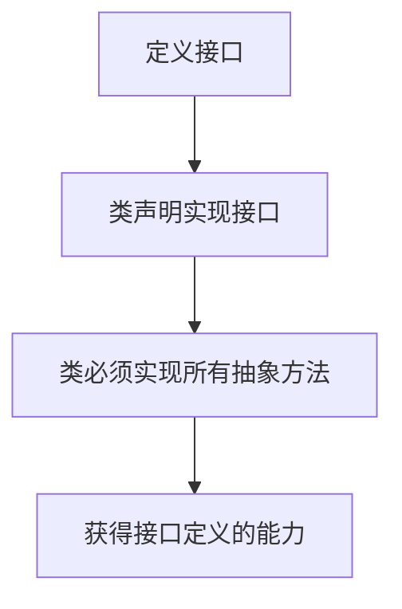

## 6.1 接口

​	接口（英文：Interface），在JAVA编程语言中是一个抽象类型，是抽象方法的集合，接口通常以interface来声明。一个类通过继承接口的方式，从而来继承接口的抽象方法。


#### 6.1.1 接口概念

​	接口不是类，而是类对一组需求的描述。它是抽象方法的集合，但不包含方法的实现。**接口定义了一组行为规范，而类可以实现一个或多个接口，从而提供这些行为的具体实现**。

​	假设现在定义一个Comparable接口，里面包含一个compareTo方法，用于比较大小，如x.compareTo(y)，当x小于y时返回负数，反之返回一个正数，如果x等于y返回0；

```java
public interface Comparable
{
    int compareTo(Object other);
    
}
```

​	接口中的所有方法自动地被隐式声明为`public abstract`。在接口中声明方法时，不必提供关键字`public`。如果提供了其他修饰符则会报错。接口通常包含一个或多个方法。而且接口中可以含有变量，但是接口中的变量会被隐式的指定为`public static final`变量（也就是常量）

实现方法的任务应该由实现接口的那个类来完成。如果Employee类想通过compareTo方法进行排序，那么Employee类就必须实现Comparable接口

让类实现一个接口，通常需要两个步骤：

1. **让类声明为实现给定的接口。**
2. **对接口中的所有方法进行定义。**

要让类声明为实现某个接口，需要使用关键字`implements`:

```java
class Employee implements Comparable
```

此时，该类就需要提供compareTo方法的实现，假设根据雇员的薪水进行比较，下面是compareTo方法的实现：

```java
public int compareTo(Object otherObject)
{
    Employee other = (Employee)otherObject;
    return Double.compare(salar,other.salary);
}
```

在这里，我们使用了静态 `Double.compare` 方法， 如果第一个参数小于第二个参数， 它会返回一个负值；如果二者相等则返回 0; 否则返回一个正值

**接口是独立于类的，遵循“谁想使用，谁就实现”的原则，且一旦声明实现，必须实现接口中的所有方法**。下面这个图很好的解释了接口的应用：



​	在Array类中有一个sort方法，Employee要是想用它就必须实现Comparable接口（Comparable接口是在java标准库中已存在的，所以直接使用implements实现它即可）

注意：在java SE5.0中，Comparable接口已经改进为泛型类型

```java
public interface Comparable<T>
{
    int compareTo(T other);
}
```

这里的T代表这个接口可以接受任意参数类型，在实现它时需要指定类型，如Employee类。泛型是java5引入的重要特性。

对比非泛型接口，泛型接口的好处有很多

```java
// 非泛型版本（Java 5 之前）
public class Employee implements Comparable {
    public int compareTo(Object other) {
        // 需要手动类型检查和转换
        if (!(other instanceof Employee)) 
            throw new ClassCastException();
        Employee e = (Employee) other;
        return Double.compare(salary, e.salary);
    }
}
```

而泛型接口能在编译时自动检查，无需类型转换且编译时能捕获错误

```java
// 泛型版本（现代写法）
public class Employee implements Comparable<Employee> {
    public int compareTo(Employee other) {
        // 直接使用 Employee 类型参数
        return Double.compare(salary, other.salary);
    }
}
```


一个类要使用排序服务必须让他实现compareTo方法，因为要向sort方法提供比较对象的方式。sort方法中可能存在下面的语句：

```java
if(a[i].compareTo(a[j])>0)
{
    ....
}
```

为此，想要使用sort的类就必须实现Comparable接口中的方法。

下面的程序提供了完整的代码

```java
//EmployeeSortTest
package interfaces;
import java.util.*;

public class EmployeeSortTest {

    public static void main(String args[])
    {
        /*创建数组列表*/
        Employee[] staff = new Employee[3];


        staff[0] = new Employee("Carl Cracker",7000);
        staff[1]=new Employee("Harry Hacker",8000);
        staff[2]=new Employee("Tony Tester",4000);

        Arrays.sort(staff);
        //给每个人提薪百分之30
        for (Employee e:staff)
            e.raiseSalary(30);

        for (Employee e:staff)
            System.out.println("name="+e.getName()+", salary="+e.getSalary());
    }
}
```

```java
//Employee
package interfaces;

import java.time.temporal.Temporal;

//实现Comparable接口并且泛型指定为Employee类
public class Employee implements Comparable<Employee> {

    private String name;
    private double salary;

    public Employee(){}
    public Employee(String name,double salary)
    {
        this.name=name;
        this.salary=salary;
    }

    public String getName() {
        return name;
    }

    public void setName(String name) {
        this.name = name;
    }

    public double getSalary() {
        return salary;
    }

    public void setSalary(double salary) {
        this.salary = salary;
    }

    public void raiseSalary(double byPercent)
    {
        double raise = salary *(byPercent/100); //提薪金额；
        salary+=raise;
    }
    
    /**
    * 实现Comparable接口中的compareTo方法
    *
    */
    @Override
    public int compareTo(Employee other) {
        /*比较两者薪水*/
        return Double.compare(salary,other.salary);
    }
}
```


##### API 

**int compareTo(T other)    //java.lang.Comparable\<T\>**

用这个对象与other进行比较。如果这个对象小于other则返回负值；如果相等返回0；否则返回正值

**static void sort(Object[] a )   //java.util.Arrays ** 

使用mergesort(合并排序)算法对数组a中的元素进行排序。要求数组中的元素必须属于实现了Comparable接口的类，并且元素之间必须是可比较的。

**stiatic int compara(int x,int y)**

如果x<y返回一个负数；如果x和y相等返回0；否则返回一个正数。


#### 6.1.2 接口的特性

**接口不是类，不能使用new运算符实例化一个接口**：

```java
x = new Comparable(...); //ERROR
```

**但是能声明接口的变量**；

```java
Comparable x; //ok
```

**接口变量必须引用实现了接口的类对象**，如上例的Employee类：

```java
x=new Employee(...);  //ok
```

接下来， 如同使用 instanceof 检查一个对象是否属于某个特定类一样， 也可以使用instanceof检查一个对象是否实现了某个特定的接口：

```java
if(anObject instanceof Comparable){...}
```


与可以建立类的继承关系一样，**接口也可以被扩展**。假设有一个被称为Moveable的接口：

```java
public interface Moveable
{
    void move(double x,double y);
}
```

可以以它为继承扩展一个叫做Powered的接口

```java
public interface Powered extends Moveable
{
    double milePerGallon();
}
```


接口中不能包含成员和静态方法，但可以包含常量：

```java
public interface Powered extends Moveable
{
  double milesPerGallon();
  double SPEED_LIMIT=95;
}
```

**接口中的成员将被自动设置为public static final**;

​	**任何实现接口的类都会自动继承这些常量，并可以在方法中直接的引用该常量。每个类只能拥有一个父类，但却可以实现多个接口**。这就为定义类的行为提供了极大的灵活性。

​	例如， Java 程序设计语言有一个非常重要的内置接口， 称为 Cloneable。如果某个类实现了这个 Cloneable 接口，Object 类中的 clone 方法就可以创建类对象的一个拷贝。 如果希望自己设计的类拥有克隆和比较的能力， 只要实现这两个接口就可以了； 使用逗号将实现的各个接口分隔开。

```java
class Employee implements Cloneable,Comparable
```


#### 6.1.3 接口与抽象类

如果知道了抽象类的内容，会产生为什么不直接将Comparable这样的接口设计为抽象类的疑问。

```java
abstract class Comparable //why not?
{
    public abstract int compareTo(Object other);
}
```

然后，Employee类再直接扩展这个抽象类，并提供compareTo方法的实现：

```java
class Employee extends Comparable
{
    public int compareTo(Object other){...}
}
```

这是因为，使用抽象类表示通用属性存在一个问题：**每个类只能扩展于一个类**。假设Employee已经扩展于一个类，例如Person，它就不能再扩展第二个类

```java
class Employee extends Person,Comparable //Error
```

但**每个类可以实现多个接口**：

```java
class Employee extends Person implements Comparable //ok
```

​	有些程序设计语言允许一个类有多个超类， 例如 C++。我们将此特性称为多重继承( multiple inheritance)。而 Java 的设计者选择了不支持多继承，其主要原因是多继承会让语言本身变得非常复杂（如同 C++)， 效率也会降低 

​	实际上， 接口可以提供多重继承的大多数好处，同时还能避免多重继承的复杂性和低效性。

​	在Java SE8中，允许在接口中增加静态方法。


#### 6.1.5 默认方法

可以为接口方法提供一个默认实现。用default修饰符标记这样一个方法。

```java
public interface Comparable<T>
{
    default int compareTo(T other)
    {
        return 0;
    }
}
```

当然，这并没有太大用处，因为Comparable的每一个实际实现都要覆盖这个方法。不过有些情况下，默认方法可能有用。例如，如果希望在发生鼠标点击事件时得到通知，就要实现一个包含5个方法的接口：

```java
public interface MouseListener
{
    void mousedieked(MouseEvent event);
	void mousePressed(MouseEvent event);
	void mouseReleased(MouseEvent event);
	void mouseEntered(MouseEvent event);
	void mouseExited(MouseEvent event)
}
```

在 Java SE 8 中， 可以把所有方法声明为默认方法。

```java
public interface MouseListener
{
    default void mousedieked(MouseEvent event) {}
	default void mousePressed(MouseEvent event) {}
	default void mouseReleased(MouseEvent event) {}
	default void mouseEntered(MouseEvent event) {}
	default void mouseExited(MouseEvent event) {}
}
```

这样一来，实现这个接口的程序员只需要为他们真正关心的事件覆盖相应的监听器。


#### 6.1.6 解决默认方法冲突

如果现在一个接口中奖一个方法定义为默认方法，然后又在超类或另一个接口中定义了同样的方法。java会有相应的规则：

1. 超类优先。如果超类提供了一个具体方法，同名而且有相同参数类型的默认方法会被忽略。
2. 接口冲突。如果一个超接口提供了一个默认方法，另一个接口提供了一个同名且参数类型相同的方法，必须覆盖这个方法来解决冲突。


下面考虑一个包含getName的接口：

```java
interface Named
{
    default String getName(){return ....};
}
```

一个类同时实现了两个接口

```java
class Student implement Person,Named
{
    ...
}
```

类会继承Person和Named接口提供的两个不一致的getName方法。Java编译器会报告一个错误，让程序员来解决这个二义性。**只需在类中提供一个同样的方法**。

```java
class Student implement Person,Named
{
   public String getName(...);
}
```


## 6.2 接口示例

接下来的 3 节中， 我们将给出接口的另外一些示例， 可以从中了解接口的实际使用。


#### 6.2.1 接口与回调

​	**回调（callback)是一种常见的程序设计模式。这种模式中，可以指定某个特定事件发生时应该采取的动作**。例如，指出在按下鼠标或选择某个菜单项时应该采取什么行动。

​	在java.swing包中有一个Timer类，可以使用它在达到给定的时间间隔时发出通告。

​	在构造定时器时，需要设置一个时间间隔，并告之定时器，当到达时间间隔时需要做什么操作。

​	如何告之定时器做什么呢？在Java标准类库中的类采用的是面向对象方法。它将某个类的对象传递给定时器，然后定时器调用这个对象的方法。由于对象可以携带一些附加的信息，所以传递一个对象比传递一个函数灵活得多。

​	当然，**定时器需要知道调用哪个方法，并要求传递的对象所属的类实现了java.awtevent包的ActionListener接口**。下面是这个接口：

```java
public interface ActionListener
{
    void actionPerformed(ActionEvent event);
}
```

**当到达指定的时间间隔时，定时器就调用actionPerformed方法**

假设希望每隔 10 秒钟打印一条信息“At the tone, the time is . . .”， 然后响一声， 就应该定义一个实现 ActionListener 接口的类， 然后将需要执行的语句放在 actionPerformed 方法中。

```java
class TimePrinter implements ActionListener
{
    public void actionPerformed(ActionEvent event)
    {
        System.out.println("At the tone,the time is" + new Date());
        Toolkit.getDefaultToolkit().beep(); //蜂鸣器
    }
}
```

接下来，构造这个类的一个对象，并将他传递给Timer构造器

```java
ActionListener listener = new TimePrinter();
Timer t = new Timer(10000,listener);
```

Timer构造器的第一个参数是发出通过的时间间隔，它的单位是毫秒，这里希望每隔10秒通告一次，第二个参数是监听器对象。

最后，启动定时器：

```java
t.start();
```

下面的程序给出了定时器和监听器的操作行为。

```java
package timer;

import java.awt.*;
import java.awt.event.*;
import java.util.*;
import javax.swing.*;
import javax.swing.Timer;
public class TimerTest {
    public static void main(String[] args) {
        // 接口引用指向实现类实例
        ActionListener listener = new TimePrinter();
		
        Timer timer = new Timer(10000, listener);
        timer.start();
        JOptionPane.showMessageDialog(null, "Exit program?"); //打印退出窗口
        System.exit(0);
    }
}

class TimePrinter implements ActionListener
{
    @Override
    public void actionPerformed(ActionEvent event)
    {
        System.out.println("At the tone,the time is" + new Date());
        Toolkit.getDefaultToolkit().beep(); //蜂鸣器
    }
}
```

​	无需关心实现方法中的参数ActionEvent event。目前并没有使用它。注意定时器Timer类要求所传递对象所属的类必须实现了java.awtevent包的ActionListener接口。	

##### API

**static void showMessageDialog(Component parent,Object message)  //javax.swing.JOptionPane **

显示一个包含一条消息和OK按钮的对话框。这个对话框将位于其parent组件的中央。如果parent为null，对话框将显示在屏幕的中央。


<em>**javax.swing.Timer**</em>

**Timer(int interval, ActionListener listener)**

构造一个定时器，每隔interval毫秒通告listener一次。listener类必须实现java.awtevent包的ActionListener接口。（1s=1000ms）

**void start()**

启动定时器。一旦启动成功，定时器将调用监听器的actionPerformed;

**void stop()**

停止定时器。一旦停止成功，定时器将不再调用监听器的actionPerformed;


<em>**java.awt.Toolkit**</em>

**static Toolkit getDefaultToolkit()**

获得默认的工具箱。工具箱包含有关GUI环境的信息。

**void beep()**

发出一声领响。


#### 6.2.2 Comparator接口

​	想要使用Arrarys.sort对一个对象数组排序,那么该对象所属的类就必须实现了Comparable接口。可以对一个字符串数组进行排序，因为String类已经实现了

Comparable\<String\>。

​	假设希望按长度递增的顺序对字符串进行排序，而不是按字典顺序进行排序。要处理这种情况，Arrays.sort方法还有第二个版本。参数为一个数组和一个比较器（comparator)

​	比较器是实现了Comparator接口的类的实例

```java
public interface Comparator<T>
{
    int compare(T first ,T second);
}
```

要按长度比较字符串，可以如下定义一个实现Comparator\<String>的类

```java
class LengthComparator implements Comparator<String>
{
    public int compare(String first,String second)
    {
        return first.length() - second.length();
    }
}
```

要对一个数组排序，需要为Arrays.sort方法传入一个实现了Comparator接口的实例，也就是LengthComparator类对象：

```java
String[] friends={"Peter","paul","May"};
Arrays.sort(friends,new LengthComparator());
```

下面是一个程序

```java
package CompareString;

import java.util.Comparator;
import java.util.Arrays;
public class CompareStringTest {
    public static void main(String args[])
    {
        String[] friends={"Peter","paul","May","PerterPlus","TW","LGBTQ"};
        System.out.println("排序前：");
        for(String s:friends)
            System.out.print(s+" ");
        Arrays.sort(friends,new LengthCompareString());
        System.out.printf("\n排序后：\n");
        for(String s:friends)
            System.out.print(s+" ");
    }
}

class LengthCompareString implements Comparator<String>
{
    LengthCompareString(){}
    public int compare(String first,String second)
    {
        return first.length() -second.length();
    }
}
```


